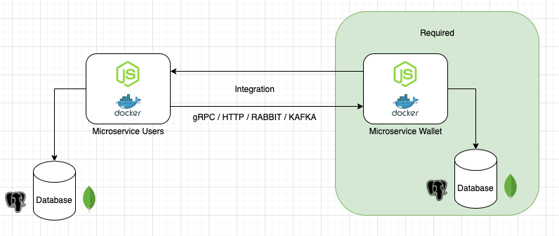

# ília - Code Challenge NodeJS
**English**
##### Before we start ⚠️
**Please create a fork from this repository**

## The Challenge:
One of the ília Digital verticals is Financial and to level your knowledge we will do a Basic Financial Application and for that we divided this Challenge in 2 Parts.

The first part is mandatory, which is to create a Wallet microservice to store the users' transactions, the second part is optional (except for Seniors, it's mandatory) which is to create a Users Microservice with integration between the two microservices (Wallet and Users), using internal communications between them, being in gRPC, REST, Kafka, RabbitMQ and this communication must have a different security of the external application (JWT, SSL, ...)

### General Instructions:
## Part 1 - Wallet Microservice

This microservice must be a digital Wallet where the user transactions will be stored 

### The Application must have

    - Project setup documentation (readme.md)
    - Application and Database running on a container (Docker, ...)
    - This Microservice must receive HTTP Request
    - Have a dedicated database (Postgres, MySQL, Mongo...)
    - JWT authentication on all routes (endpoints) the PrivateKey must be ILIACHALLENGE (passed by env var)
    - Configure the Microservice port to 3001 
    - Gitflow applied with Code Review in each step, open a feature/branch, create at least one pull request and merge it with Main(master deprecated), this step is important to simulate a team work and not just a commit

## Part 2 - Microservice Users and Wallet Integration

### The Application must have:

    - Project setup documentation (readme.md)
    - Application and Database running on a container (Docker, ...)
    - This Microservice must receive HTTP Request   
    - Have a dedicated database (Postgres, MySQL, Mongo...)
    - JWT authentication on all routes (endpoints) the PrivateKey must be ILIACHALLENGE (passed by env var)
    -Set the Microservice port to 3002 
    - Gitflow applied with Code Review in each step, open a feature/branch, create at least one pull request and merge it with Main(master deprecated), this step is important to simulate a teamwork and not just a commit
    - Internal Communication Security (JWT, SSL, ...), if it is JWT the PrivateKey must be ILIACHALLENGE_INTERNAL (passed by env var)
    - Communication between Microservices using gRPC, REST, Kafka, RabbitMQ , (if this communication needs a Docker environment too)

#### In the end, a pull request must be created in the Github repo. As soon as you finish, please let us know.

#### We are available to answer any questions.

***

**Português**
##### Antes de começar ⚠️
**Por favor, crie um fork desse repositório**

## O Desafio:
Uma das verticais da ília Digital é a Financeira e para nivelar seus conhecimentos iremos fazer uma Aplicação Financeira Básica e para isso dividimos esse Desafio em 2 Partes.

Sendo a 1ª Parte obrigatória que é criar um Microserviço de Wallet para guardar as transações de usuários, já a segunda 2ª Parte é opcional (com exceção dos Seniors, é obrigatório) que é criar um Microserviço de Usuários com Integração entre os 2 Microserviços (Wallet e Users), usando comunicações interna entre eles, sendo em gRPC, REST, Kafka, RabbitMQ e essa comunicação deve ter uma segurança diferente da aplicação externa (JWT, SSL, …)

### Instruções gerais:
## Parte 1 - Microserviço Wallet

Esse Microserviço deve ser uma Carteira digital onde vai guardar as transações de usuários 

### A Aplicação deve possuir:

    - Documentação de setup do projeto (readme.md)
    - Aplicação e Banco de Dados estarem rodando em container (Docker, …)
    - Esse Microserviço deve receber Request via HTTP
    - Ter um banco de dados dedicado (Postgres, MySQL, Mongo…)
    - Autenticação JWT em todas as rotas (endpoints) a PrivateKey deve ser ILIACHALLENGE (passada por env var)
    - Configurar a porta do Microserviço na 3001 
    - Gitflow aplicado com o Code Review em cada passo, abrir uma feature/branch, criar no mínimo um pull request e fazer o merge com a Main(master deprecated), esse passo é importante para simular um trabalho em equipe e não fazer um "commitão" somente

## Parte 2 - Microserviço Users e Integração com o Wallet

### A Aplicação deve possuir:

    - Documentação de setup do projeto (readme.md)
    - Aplicação e Banco de Dados estarem rodando em container (Docker, …)
    - Esse Microserviço deve receber Request via HTTP   
    - Ter um banco de dados dedicado (Postgres, MySQL, Mongo…)
    - Autenticação JWT em todas as rotas (endpoints) a PrivateKey deve ser ILIACHALLENGE (passada por env var)
    - -Configurar a porta do Microserviço na 3002 
    - Gitflow aplicado com o Code Review em cada passo, abrir uma feature/branch, criar no mínimo um pull request e fazer o merge com a Main(master deprecated), esse passo é importante para simular um trabalho em equipe e não fazer um "commitão" somente
    - Segurança na Comunicação Interna (JWT, SSL, …), se for JWT a PrivateKey deve ser ILIACHALLENGE_INTERNAL (passada por env var)
    - Comunicação entre os Microserviços usando gRPC, REST, Kafka, RabbitMQ , (se essa comunicação necessitar de um ambiente que colocar em ambiente em Docker também)

#### No final, um pull request deve ser criado no repositório do Github. Assim que terminar, por favor nos avise.

#### Estamos à disposição, para tirar dúvidas.

Happy coding! 🤓
